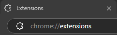
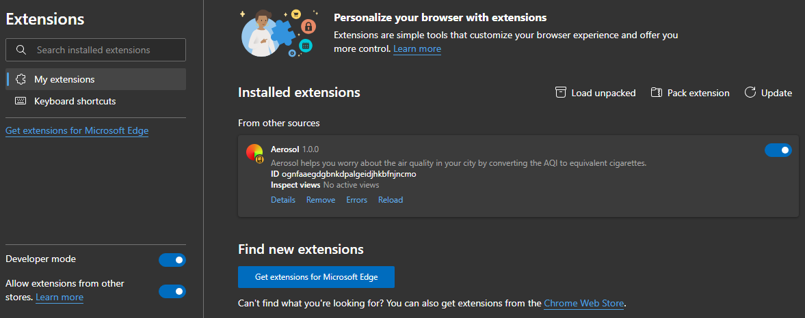

# 🌬️ Aerosol 🚬


**Aerosol** is a Chrome extension that visualizes air pollution in a way everyone understands - cigarettes!

> [!NOTE]
> Although AQI and Equivalent Cigarettes data gives a wider view, the reliability of data is up to OpenWeatherMap. There may be some degree of discrepancy and error when compared to other sources.


## 🤔 What's This All About?

Ever wondered how bad the air pollution in your city really is? Air Quality Index (AQI) numbers can be abstract and hard to grasp. **Aerosol** translates these numbers into something more tangible - the equivalent number of cigarettes you're "smoking" just by breathing the air.

## 📸 Preview


## ✨ Features

- 🔍 **AQI Search for cities**: Look up for the AQI of any city arounf the world!
- 📊 **Cigarettes counter**: See the equivalent "cigarette count" of the AQI of any city.
- 🌎 **Global Coverage**: Works with AQI data from basically all the cities. Thanks, OpenWeatherMap API.

## 🚀 Installation

1. Download the latest `aerosol.zip` from the `Releases` or directly from the repo.

2. Unzip the file in a location of choice on your computer.

3. Open Chrome or any other Chromium-based browser and open the extensions page (`chrome://extensions`).

4. Enable `Developer mode`, click `Load unpacked` and select the folder with the contents of unzipped `aerosol.zip` file.

5. There you have it—Aerosol has been installed on your browser. Enjoy!


## 🧠 The Science Behind It

Aerosol uses peer-reviewed research from the University of California, Berkeley that established the relationship between PM2.5 exposure and cigarette smoking:

> "One cigarette is equivalent to an air pollution PM2.5 of 22 μg/m³ for 24 hours"

We use this formula along with current AQI readings to calculate your "cigarette exposure" from ambient air pollution.

## 💡 How to Use

### 1️⃣ Toggle the extension


### 2️⃣ Enter the name of the city you want to look up for, and hit Enter


### 3️⃣ View your 'Air Quality Index' and 'Equivalent Cigarettes'


## 🌍 Locations with Highest Average "Cigarette Counts"

| Rank | City | Country | Daily Cigarette Equivalent |
|------|------|---------|----------------------------|
| 1 | Delhi | India | 22.1 |
| 2 | Lahore | Pakistan | 19.8 |
| 3 | Dhaka | Bangladesh | 18.3 |
| 4 | Beijing | China | 16.5 |
| 5 | Jakarta | Indonesia | 14.2 |

## 📈 Impact Visualization

```
Delhi       🚬🚬🚬🚬🚬🚬🚬🚬🚬🚬🚬🚬🚬🚬🚬🚬🚬🚬🚬🚬🚬🚬 (22.1)
Lahore      🚬🚬🚬🚬🚬🚬🚬🚬🚬🚬🚬🚬🚬🚬🚬🚬🚬🚬🚬🚬 (19.8)
Dhaka       🚬🚬🚬🚬🚬🚬🚬🚬🚬🚬🚬🚬🚬🚬🚬🚬🚬🚬 (18.3)
Beijing     🚬🚬🚬🚬🚬🚬🚬🚬🚬🚬🚬🚬🚬🚬🚬🚬🚬 (16.5)
Jakarta     🚬🚬🚬🚬🚬🚬🚬🚬🚬🚬🚬🚬🚬🚬 (14.2)
Los Angeles 🚬🚬🚬🚬 (4.3)
New York    🚬🚬🚬 (3.1)
London      🚬🚬 (2.4)
Sydney      🚬 (1.2)
```

## 🛠️ Made Using

- 🌐 HTML
- 🎨 CSS
- 📊 JS
- ☁  AQI data from [OpenWeatherMap](https://openweathermap.org)

## 🙋‍♀️ FAQs

### Is this scientifically accurate?
I mean, if you trust Claude then yeah. The calculated data seems a bit off from what other calculators do (with an avg discrepancy of around 0.5 cigarettes). There is a discrepancy of 10-40 AQI too, when compared to other sources. This is also on Claude.

### Does this work everywhere?
Aerosol works in any location covered by our air quality data providers, which includes most major cities worldwide.

### How often is the data updated?
As often OpenWeatherMaps wills to update it.

## 🤝 Contributing & Feedbacks
Your feedback and help matters! If you have any feature suggestion or have found a bug, please raise the issue on this repo. Also, Check out our [CONTRIBUTING.md](https://github.com/raghav-karn/.github/blob/main/CONTRIBUTING.md) for detailed guidelines. All contributions are welcome!

## Credits

- **OpenWeatherMap**'s API was used to provide data on AQI.
- **Claude.ai** was partially used to write the code to help process the data abdnd convert the calculated AQI to Equivalent Cigarettes.
- **Figma** was used to create the icons.

## 📝 License

This project is licensed under the MIT License - see the [LICENSE](LICENSE) file for details.

---

A [BrowserBuddy](https://browserbuddy.hackclub.com) project by [Raghav Karn](https://github.com/raghav-karn).