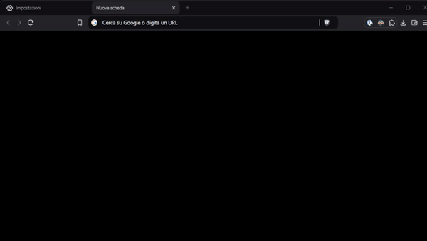

# Browser Bangs

> Add DuckDuckGo bangs in your browser.

## What are Bangs?

Bangs are shortcuts that quickly take you to search results on other sites. For example, typing `!w` before your search query will take you to the Wikipedia page for that query.

## How to use Bangs?

1. Go to the address bar of your browser.
2. Type your query and add your !bang in it.
3. Press Enter.

## List of Bangs

You can find the list of bangs [here](https://duckduckgo.com/bang).

## Supported Search Engines

- Google
- Bing
- Yahoo

## Building

1. Clone the repository.
2. Install the dependencies using `pnpm install`.
3. Run the build script using `pnpm build`.
4. Load the extension in your browser using the `dist` folder.