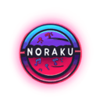

# **Noraku** 🎵  

  

A browser extension that enhances your browsing experience by adding immersive sound effects to various actions!  

> **Note:** This extension is still in development, and more features will be added soon! 🚀  

---

## **Features 😎**  

✅ **Tab Open & Close Sounds** – Experience satisfying sound feedback when opening and closing tabs.  
✅ **Action-Based Sound Effects** – Hear unique sounds for actions like bookmarking, downloading, muting tabs, and more.  
✅ **Keypress Sounds** – Custom sound effects for different key types (A-Z, Spacebar, Function Keys, etc.).  
✅ **Search Interaction Sounds** – Audio feedback when interacting with search bars.  
✅ **Error & Block Action Sounds** – Get notified with sounds when an action fails or is blocked.  
✅ **Theme Selection (Coming Soon)** – Choose from different anime/game themes with unique sound effects.  
✅ **Custom Sound Support (Coming Soon)** – Upload your own sound effects for a personalized experience.  
✅ **Website Integration (Planned)** – A full website where users can configure settings.  

---

## **Privacy Policy 🔒**  

Noraku does **not** collect, track, or share any user data. All settings are stored **locally** on your device. Your privacy is our priority.  

---

## **Installation 🛠️**  

Installing **Noraku** is simple!  

1️⃣ **Download the Repository**  
- Click the **"Code"** button on GitHub and select **"Download ZIP"**.  
- Extract the ZIP file on your computer.  

**OR**  

Run this command in your terminal (**requires Git**):  
```bash
git clone https://github.com/Diptanu761/noraku.git
```

2️⃣ **Load the Extension in Chrome**
- Open Google Chrome and go to chrome://extensions.
- Enable "Developer Mode" (toggle switch in the top right).
- Click "Load Unpacked" and select the Noraku folder.

3️⃣ **Done! 🎉 Enjoy the sound-enhanced browsing experience.**

---

## **To-Do list ✏️**

- [ ] Add a website where users can configure settings 🌐

---

## **Special Thanks 💖**

🎨 Logo Designed by: @ShibamRoy9826
Thank you for creating the Noraku logo and being a great help in this project! 🙌

---

## **Contributing 🙏**

We welcome contributions! 💙
- Found a bug? Report it by opening an issue.
- Have an idea? Suggest a feature request.
- Want to contribute? Fork the repository and submit a pull request.

> ✨ Please consider starring this repository if you like the project!
