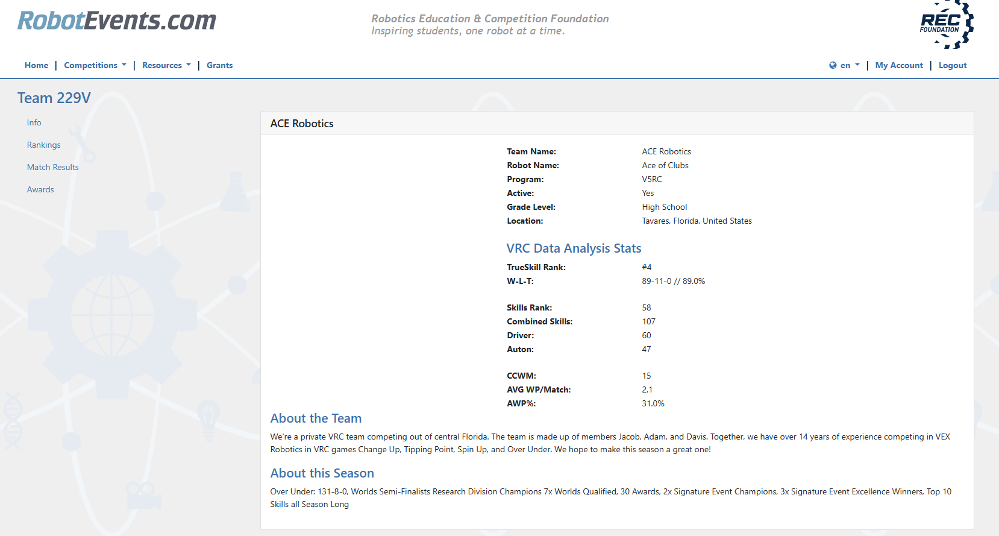

# RobotEvents Scout

This extension is the first of its kind to provide detailed VEX Robotics team statistics directly on their team page. Whereas traditionally this information would be scattered across multiple sources and would require downloading mobile apps to view, this extension makes it easy for scouters to find additional information on teams.  

Usage:
1. Install the extension from the chrome web store [link](placeholder.com)
2. Open any VEX V5RC Team Page on RobotEvents
- No other manual inputs are needed, as the extension will automatically scour the web for data and display them when a team page is opened.

To test if the extension is working, visit https://www.robotevents.com/teams/V5RC/210Z and ensure that information is loaded below the "V5RC Stats" header

