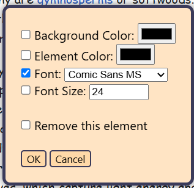

# Style Wizard
---

###### **Tired of seeing boring / ugly websites?**
###### Style Wizard is a browser extension adding the feature to quickly change a website's style
---

## Usage:
- Get the extension [coming soon](here) [Coming Soon]
- Or clone the repo and load it by yourself
- Activate it
- Right click on any website (open context menu)
- Click ``Activate Styling``
- Hold ``ctrl`` (Windows / Linux) or ``cmd`` (MacOS) and click the element you want to modify
- Change the values and tick what should be kept
- Click ``OK`` or ``Cancel``

## Features:
- Easy to accsess via a key combination
- Change:
    - Background color
    - Element color / Font Color
    - Font Family
    - Font Size
- Remove an element
- If you need help, click the extensions icon on the top right and click the StyleWizard icon

## Screenshots:

-**Instead of:**

-**Why not:**

-**Or even:**

(Images from wikipedia)

## License:
- See License.txt

#### Made by Qwatrum
