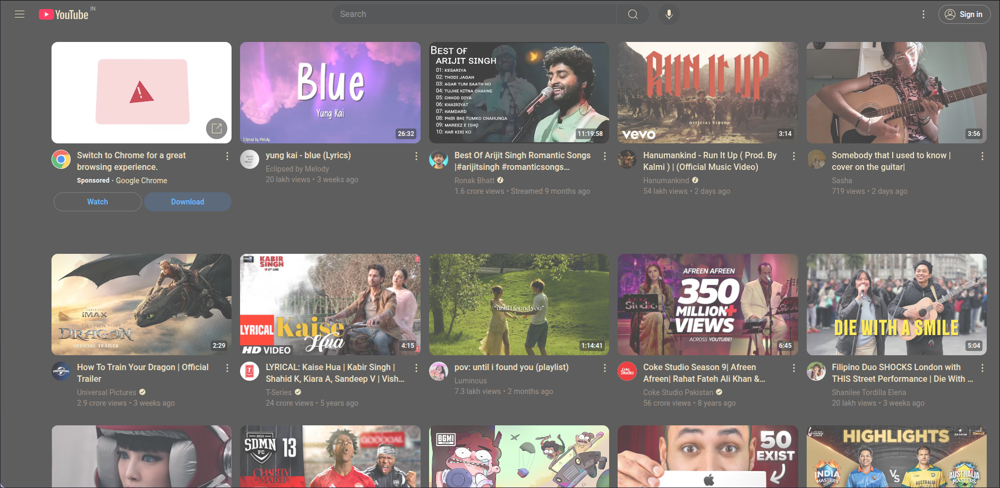

# TweakTube


A chrome extension that allows you to customize [youtube](https://youtube.com) to your liking!

> [!NOTE]
> This is in very early stages, and may have bugs

## Features 😎

- Allows to hide shorts
- Allows to hide categories section
- Allows to hide sidebar
- Comes with 9 different themes excluding the default one
- Is extremely simple to use!

## Screenshots 📷

Here are a few screenshots of some of them themes and customizations:-
If you notice properly, shorts, the sidebar, and categories section are not there!

> [!NOTE]
> Some screenshots have a white tint on them for some reason, they don't look like so irl, I will try to upload proper screenshots soon

#### Catppuccin Mocha


#### Catppuccin Latte


#### Gruvbox


More themes include - Catpuccin-Frappe, Catppuccin-Macchiato, Nord, rosepine, Solarized-dark,Solarized-light. I will add screenshots of the rest later:)

## Installation 🛠️

Installation is really simple! All you need to do is download this repository.

1. You can either use the **Green colored "code" button** on top, and click on "Download zip".
Next, you need to extract the zip file in your computer.

OR

You can also run this in your terminal(requires git):

```bash
git clone https://github.com/ShibamRoy9826/tweaktube.git
```

2. Once you have the folder extracted, 
    - Open Google Chrome
    - Go to [chrome://extensions](chrome://extensions)
    - Enable "Developer Mode" using the top right switch
    - Click on "Load unpacked"
    - Find the location where you've extracted/cloned this repository, and double click on "manifest.json"

3. Done! Now you've TweakTubes installed! Try it out and give me some feedback :) 

## Known Bugs 🐞

- A dark shadow appears in the categories bar which doesn't change even after changing theme
- Extended sidebar and community posts still don't have any effect after changing the theme

## To-Do list ✏️

- [ ] Add a youtube video download too

## Contributing 🙏

Everyone is welcome to contribute to the code!
You can also raise an issue, or suggest any features that you think would be great :)

> ✨ Please star this repository if you liked this project 😁
