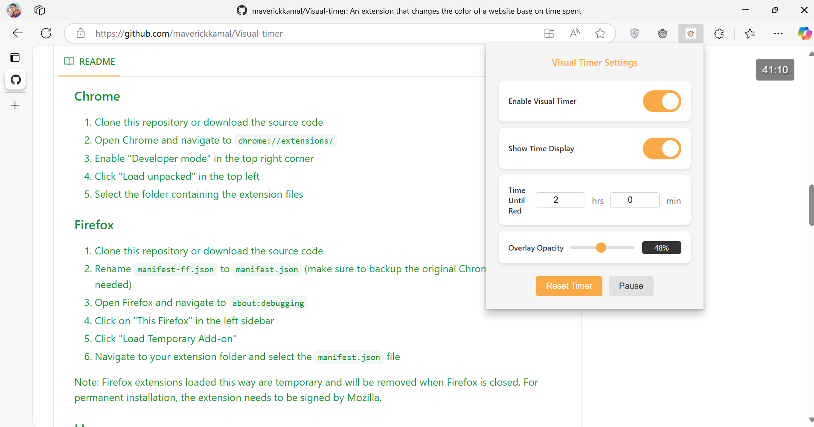

# Visual Timer Chrome/Firefox Extension

  

  
  
  
  
  
   
  
  
  

A Chrome extension that provides a visual time-tracking overlay that changes color over time, helping you stay aware of time passing while working on tasks.

## Screenshots

   
  <em>Interface of extension</em>

   
  <em>Transitioning through green</em>

   
  <em>more view of it</em>

   
  <em>overlay on youtube video</em>

## Features

- Visual color-changing overlay that transitions through different colors (Blue → Green → Purple → Red)
- Adjustable overlay opacity (1-100%)
- Customizable time settings (up to 24 hours)
- Show/hide time display
- Pause and reset functionality
- Works on all websites
- Special compatibility with YouTube
- Settings sync across Chrome instances
- Automatic pause during system idle

## Version History

### v1.4.4 (Current)
- Implemented gradual opacity increase as timer progresses
- Added gentler visual start with initially reduced opacity
- Fixed permissions policy violations with safer event listeners
- Enhanced cleanup handling for better browser compatibility
- Added fallback event listeners for cross-browser support

### v1.4.3
- Fixed multiple script injection issues
- Prevented tab reloading on message failures
- Added protection against duplicate elements
- Improved script messaging and error handling
- Added script presence detection
- Enhanced compatibility with different websites
- Reduced unnecessary tab updates

### v1.4.2
- Fixed overlay persistence after disabling extension
- Fixed glitchy behavior after system idle/sleep
- Improved state management across tabs
- Added periodic state verification
- Enhanced visibility state handling
- Improved tab reload behavior
- Added force disable functionality
- Optimized transitions and animations

### v1.4.1
- Fixed overlay flickering issue on page load/refresh
- Improved transition animations
- Enhanced initialization timing
- Optimized performance with will-change CSS property

### v1.4.0
- Added color stage customization
- Added visual timeline for color transitions
- Added color reset functionality
- Updated interface with color picker controls
- Improved color transition visualization

### v1.3.1
- Fixed message handling for better stability
- Improved error handling across browsers
- Enhanced settings synchronization
- Updated documentation

### v1.3
- Added adjustable opacity control
- Added opacity sync across browser instances
- Added tooltip for opacity percentage
- Improved settings persistence

### v1.0
- Initial release
- Basic timer functionality
- Color transitions
- YouTube compatibility

## Installation

### Watch Installation & Usage Guide

<em>👆 Click the image above to watch the installation and usage guide on YouTube</em>

### Chrome
1. Clone this repository or download the source code
2. Open Chrome and navigate to `chrome://extensions/`
3. Enable "Developer mode" in the top right corner
4. Click "Load unpacked" in the top left
5. Select the folder containing the extension files

### Firefox
1. Clone this repository or download the source code
2. Rename `manifest-ff.json` to `manifest.json` (make sure to backup the original Chrome manifest if needed)
3. Open Firefox and
