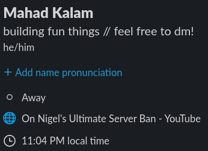
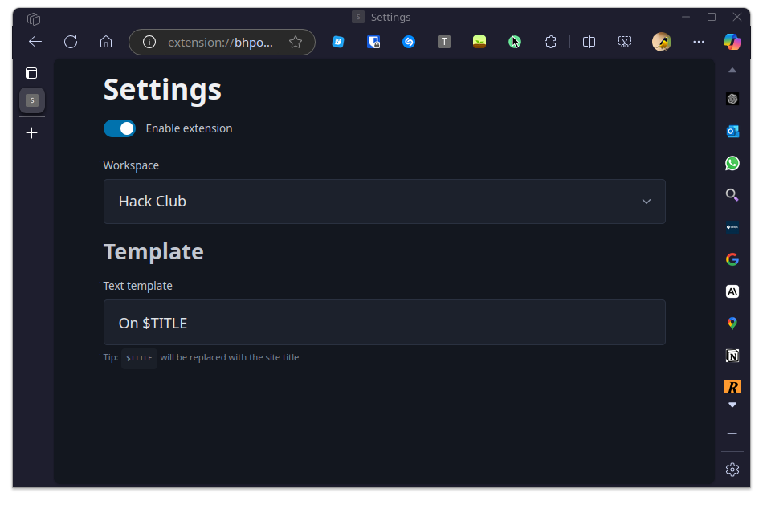

# Slack Status

An extension to automatically set your Slack status as your tab title! Made for [Browserbuddy.](https://browserbuddy.hackclub.com)

## Installing Slack Status

- [Download](https://github.com/SkyfallWasTaken/slack-status/archive/refs/heads/main.zip) and extract the extension.
- Go to `chrome://extensions` and enable Developer Mode
- Click "Load unpacked" and select the folder you just extracted
- Read the privacy statement and click "Authorize"
- Double check the Slack workspace selected in the settings page is the one you're trying to use!

---

_© 2024 Mahad Kalam_ 
_Licensed under the MIT License_
